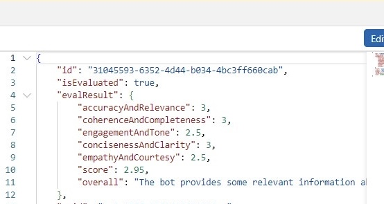
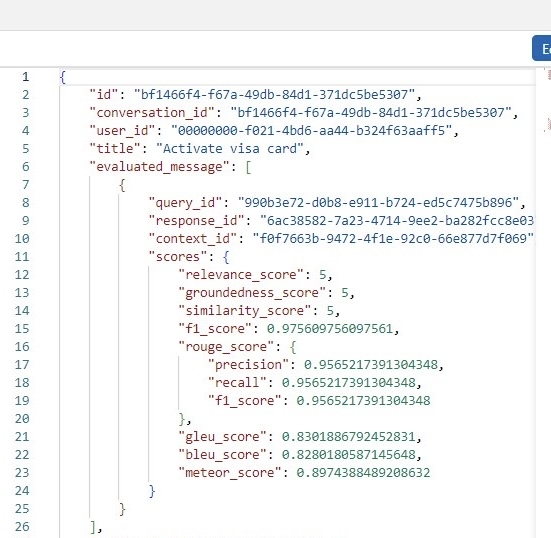

# Chatbot-Evaluation-Metrics

Implemented a real-time automated Evaluation Workflow using Python for calculating evaluation metrics (e.g., similarity, fluency, relevance scores, etc.) to assess individual chatbot interactions as well as entire conversations, triggered via Azure Functions and Azure Event Grid for event-driven processing, with results stored in Cosmos DB to enhance the quality of our chatbot responses.

Evaluation flow architecture -

Individual user-assistant evaluations -

Entire Conversation evaluation -

